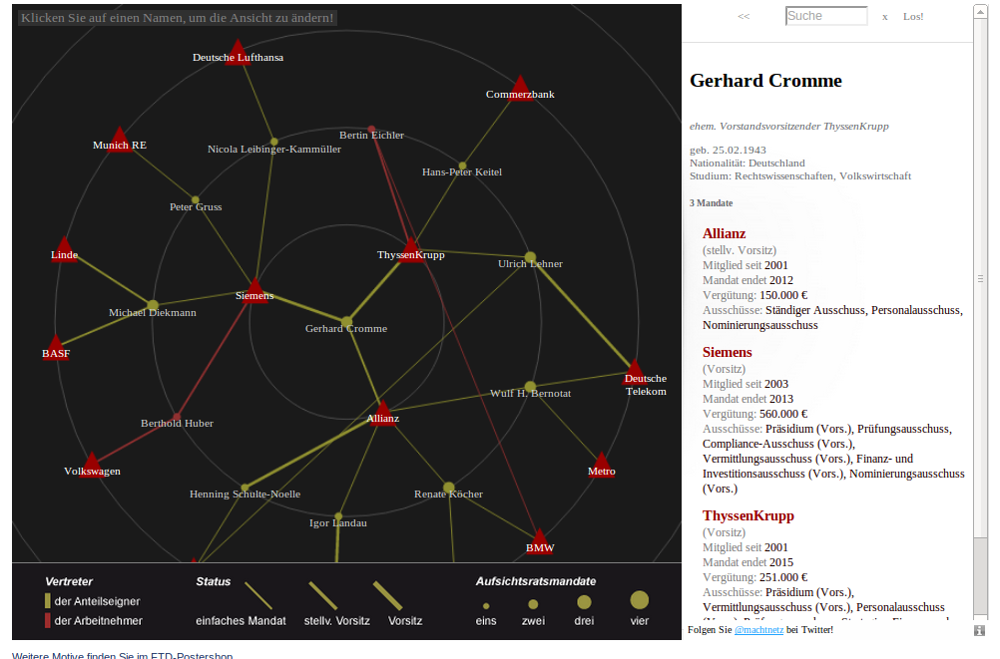

# Machtnetz - Daten

Dieses Projekt stellt Daten zur Verfügung, mit denen Machtstrukturen visualisiert werden können. Vorbild ist die Darstellung der Aufsichtsräte unter http://ftd.de/machtnetz.

## Datenformat

Die Daten liegen im Format JSON vor. Das Datenobjekt hat zwei Eigenschaften: nodes (die Knoten im Diagramm) und edges (die Verbindungen zwischen den Knoten). 

### Nodes

    { id   : '8939423',
      name : 'Gerhard Cromme',
      type : 'person'
      data : { 'geschlecht' : 'm',
               'geboren'    : '10/2/44' 
             }
    }

Die Knoten enthalten neben Name und Id noch das Attribut "type", in dem festgelegt wird, um welche Art von Knoten es sich handelt. Im Moment sind "company" und "person" als type definiert. Hinzu kommt ein data-Attribut, das je nach type bestimmte Informationen enthält kann - im Moment gibt es das Attribut nur für den type "person", und zwar lediglich Geschlecht und Geburtsdatum, hinzu kommen werden Ausbildung, ein Foto, etc.

### Edges

    { source   : '8939423',
      target   : '9833435',
      type     : 'aufsichtsratsmandat',
      data     : { 'vertritt'     : 'Vertreter der Anteilseigner',
                   'vergütung'    : '160' 
             }
    }

Die Edges enthalten die Attribut source und target, die auf die jeweiligen Knoten verweisen. Type und data sind gestaltet wie oben, im Moment gibt es nur einen type - "aufsichtsratsmandat" und die oben skizzierten Informationen Vergütung und Vertritt. Hinzu kommen werden unter Anderem Start und Ende des Mandats (als Datum). 

